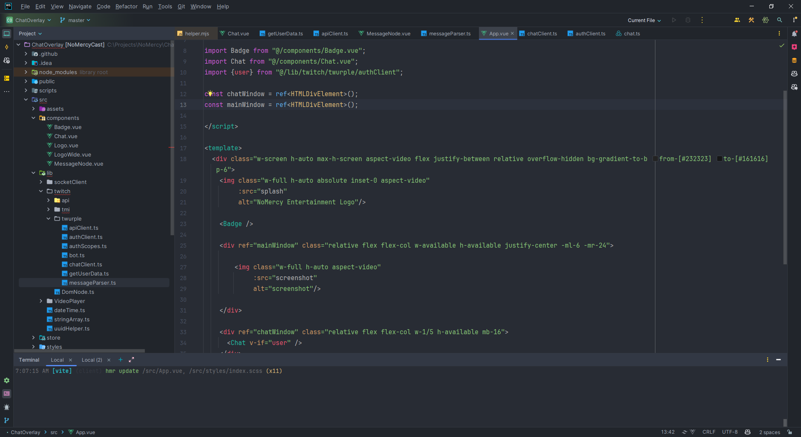

# NoMercy ChatOverlay

A customizable Twitch chat overlay with support for Spotify integration, custom badges, commands, and channel rewards.



## Features

- **Live Chat Display**: Real-time Twitch chat with user badges, emotes, and custom styling
- **Custom Badges**: Animated notifications and configurable badge texts
- **Spotify Integration**: Display now playing information from your Spotify account
- **OBS Integration**: Connect to OBS via websockets for additional functionality (not implemented yet)
- **Channel Points Rewards**: Custom handlers for Twitch channel point redemptions
- **Custom Commands**: Built-in command system with permission levels
- **Discord Integration**: Connect with your Discord account
- **List Rotation**: Commands and channel records rotate with configurable animations

## Tech Stack

- Vue 3 with Composition API
- TypeScript
- Twurple (Twitch API library)
- Spotify Web API
- Tailwind CSS
- Vite

## Installation

1. Clone the repository
   ```bash
   git clone https://github.com/yourusername/NoMercy-ChatOverlay.git
   cd NoMercy-ChatOverlay
   ```

2. Install dependencies
   ```bash
   yarn install
   ```

3. Create a `.env` file based on the example provided
   ```bash
   cp .env.example .env
   ```

4. Configure your environment variables (see Configuration section below)

5. Start the development server
   ```bash
   yarn dev
   ```

## Setting up API Access

### Twitch Setup
1. Go to [Twitch Developer Console](https://dev.twitch.tv/console/apps)
2. Create a new application
3. Set the OAuth Redirect URL to the URL where your overlay will be hosted
   - For local development, use `http://localhost:5173`
4. Copy the Client ID and generate a Client Secret
5. Add these values to your `.env` file:
   ```
   VITE_TWITCH_CLIENT_ID=your_client_id
   VITE_TWITCH_CLIENT_SECRET=your_client_secret
   ```
6. When you first run the application, it will prompt you to authenticate with Twitch
7. After authentication, you'll receive access and refresh tokens that will be stored in your `.env` file

### Spotify Setup
1. Go to [Spotify Developer Dashboard](https://developer.spotify.com/dashboard/)
2. Create a new app
3. Set the Redirect URI to the URL where your overlay will be hosted
   - For local development, use `http://localhost:5173`
4. Copy the Client ID and Client Secret to your `.env` file:
   ```
   VITE_SPOTIFY_CLIENT_ID=your_spotify_client_id
   VITE_SPOTIFY_CLIENT_SECRET=your_spotify_client_secret
   VITE_SPOTIFY_REDIRECT_URI=http://localhost:5173
   ```
5. When you first run the application, you'll need to authenticate with Spotify to obtain access and refresh tokens

## Building for Production

```bash
yarn build
```

The built files will be in the `dist` directory, ready to be deployed.

## Configuration

The following environment variables need to be configured in your `.env` file:

### Twitch Configuration
```
VITE_CHANNEL_ID=your_channel_id
VITE_CHANNEL_NAME=your_channel_name
VITE_TWITCH_CLIENT_ID=your_twitch_client_id
VITE_TWITCH_CLIENT_SECRET=your_twitch_client_secret
VITE_TWITCH_CLIENT_ACCESS_TOKEN=your_access_token
VITE_TWITCH_CLIENT_REFRESH_TOKEN=your_refresh_token
```

### Bot Configuration
```
VITE_TWITCH_BOT_NAME=your_bot_name
VITE_TWITCH_BOT_ACCESS_TOKEN=your_bot_access_token
VITE_TWITCH_BOT_REFRESH_TOKEN=your_bot_refresh_token
```

### Spotify Configuration
```
VITE_SPOTIFY_CLIENT_ID=your_spotify_client_id
VITE_SPOTIFY_CLIENT_SECRET=your_spotify_client_secret
VITE_SPOTIFY_REDIRECT_URI=your_redirect_uri
VITE_SPOTIFY_OAUTH_TOKEN=your_spotify_oauth_token
VITE_SPOTIFY_REFRESH_TOKEN=your_spotify_refresh_token
```

### Discord Configuration
```
VITE_DISCORD_CLIENT_ID=your_discord_client_id
VITE_DISCORD_CLIENT_SECRET=your_discord_client_secret
VITE_DISCORD_OAUTH_TOKEN=your_discord_oauth_token
VITE_DISCORD_SESSION_TOKEN=your_discord_session_token
```

#### How to obtain Discord Session Token

The Discord Session Token is required for live Spotify updates as it provides special permissions not available through regular OAuth tokens. To obtain it:

1. Open Discord in your web browser (not the desktop app)
2. Login to your Discord account
3. Open the browser's Developer Tools (F12 or right-click → Inspect)
4. Navigate to the Network tab
5. Make any action in Discord (like clicking on a channel or sending a message)
6. Find any request to Discord's API (look for requests to `discord.com`)
7. Click on the request and look for the "Authorization" header in the request headers
8. Copy the full token value (without the word "Bearer" if present)
9. Add this value as `VITE_DISCORD_SESSION_TOKEN` in your `.env` file

**Important**: Keep this token secure as it provides full access to your Discord account. Never share it publicly or commit it to a public repository.

### OBS Configuration
```
VITE_OBS_WEBSOCKET_URL=your_obs_websocket_url
VITE_OBS_WEBSOCKET_PASSWORD=your_obs_websocket_password
```

### Badge Text Configuration
```
VITE_BADGE_TEXTS='["Text1","Text2","Text3"]'
```

### WebSocket Configuration (Optional)
```
VITE_WEBSOCKET_URL=your_websocket_url
VITE_WEBSOCKET_AUTH_TOKEN=your_websocket_auth_token
```

## Customizable UI Settings

The NoMercy ChatOverlay provides various UI settings that can be adjusted to match your stream's aesthetics and functional preferences. These settings are configured in the `src/store/config.ts` file:

### Badge Animation Settings
```typescript
// Duration in seconds for badge transitions
export const badgeTransitionDuration = ref(2);

// Duration in seconds for how long the badge stays open
export const badgeOpenDuration = ref(10);

// Duration in seconds for how long the badge stays closed
export const badgeClosedDuration = ref(10);
```

### Chat Message Settings
```typescript
// Duration in seconds for how long chat messages are displayed
export const chatShowDuration = ref(30);

// Duration in seconds for chat animation effects
export const chatAnimationDuration = ref(0.75);
```

### Lists Rotation Settings
```typescript
// Duration in seconds each list is shown before rotating
export const listsShowDuration = ref(15);

// Delay in seconds between switching lists
export const listsSwitchDelay = ref(5);

// Duration in seconds for the animation effect when rotating lists
export const listsAnimationDuration = ref(0.5);
```

The ChatOverlay includes a ListsRotator component that alternates between showing the Commands list and the Channel Records list. Instead of displaying both lists simultaneously, the component shows one list at a time with smooth animations between them, providing a cleaner interface.

#### ListsRotator Configuration

The ListsRotator component accepts a `direction` property that determines which way the lists slide in and out:

```html
<ListsRotator direction="left" />
```

Available direction options:
- `"left"` (default): Lists slide in from and exit to the left
- `"right"`: Lists slide in from and exit to the right
- `"top"`: Lists slide in from and exit to the top
- `"bottom"`: Lists slide in from and exit to the bottom

The animation sequence works as follows:
1. The current list is displayed for `listsShowDuration` seconds (15 seconds by default)
2. The current list slides out in the specified direction
3. The system waits for `listsSwitchDelay` seconds (5 seconds by default)
4. The next list slides in from the same direction

You can customize the timing of these animations in the `src/store/config.ts` file.

### Badge Text Configuration
You can configure the rotating text displayed in the badge by setting the `VITE_BADGE_TEXTS` environment variable in your `.env` file. This should be a JSON array of strings:

```
VITE_BADGE_TEXTS='["Your Channel Name","Your Slogan","Your Website URL","Special Announcement"]'
```

Special messages like the latest follower or subscriber will be automatically shown in the badge rotation at regular intervals.

### Styling Customization

The main styles for the overlay can be found in `src/styles/index.scss`. You can modify this file to change colors, fonts, sizes, and other visual aspects of the overlay.

The default accent color is set as:
```typescript
export const defaultColor = '#f72264';
```

## Components Overview

The NoMercy ChatOverlay consists of several key components:

### Chat Component
Displays Twitch chat messages with user badges, emotes, and styling.

### Badge Component
Animated notification badge that displays rotating text messages and special announcements.

### NowPlaying Component
Shows the currently playing song from Spotify with album art and track details.

### ListsRotator Component
Alternates between showing the Commands list and the Channel Records list with smooth animations.

### BaseList Component
A reusable list template used by both CommandsList and RecordsList, providing consistent styling.

## Creating Commands and Rewards

The project includes helper scripts to create new commands and channel point rewards.

### Creating a new command

```bash
yarn make:command
# Or directly with a name:
yarn make:command commandName
```

When you create a new command, it uses the following template structure:

```typescript
import type { Command } from '@/types/chat';
import chatClient from '@/lib/twitch/chatClient';

interface CommandNameStorage extends Record<string, unknown> {
}

const command: Command<CommandNameStorage> = {
  name: 'commandName',
  permission: 'everyone',    // 'broadcaster', 'moderator', 'vip', 'subscriber', or 'everyone'
  type: 'command',           // 'command', 'event', or 'message'
  storage: {},               // Persistent storage for this command
  init: () => {},            // Called when command is registered
  callback: async ({ channel, broadcasterId, commandName, params, message }) => {
    const text = `@${message.userInfo.displayName} This is the commandName command`;
    
    await chatClient.say(channel, text);
  },
};

export default command;
```

#### Command Properties

- **name**: The command name that users will type after the prefix (e.g., `!commandName`)
- **permission**: Who can use this command:
  - `broadcaster`: Only the channel owner
  - `moderator`: Moderators and above
  - `vip`: VIPs and above
  - `subscriber`: Subscribers and above
  - `everyone`: Any viewer in chat
- **type**: The command trigger type
  - `command`: Triggered by a chat command starting with `!` 
  - `event`: Triggered by Twitch events
  - `message`: Triggered by any chat message matching certain criteria
- **storage**: An object to store persistent data for the command
- **init**: Function called when the command is first loaded
- **callback**: Function called when the command is triggered

### Creating a new reward

```bash
yarn make:reward
# Or directly with name and ID:
yarn make:reward rewardName rewardId
```

When you create a new reward, it uses the following template structure:

```typescript
import type { Reward } from '@/types/chat';

interface RewardNameStorage extends Record<string, unknown> {
}

const reward: Reward<RewardNameStorage> = {
  name: 'rewardName',
  id: 'rewardId',          // Twitch reward ID
  storage: {},             // Persistent storage for this reward
  init: () => {},          // Called when reward is registered
  callback: async ({ channel, broadcasterId, message }) => {
    console.log(`Reward "rewardName" triggered by ${message.userInfo.displayName} in channel ${channel}`);
  },
};

export default reward;
```

#### Reward Properties

- **name**: A descriptive name for the reward
- **id**: The unique Twitch channel point reward ID (can be found using the RewardsList component)
- **storage**: An object to store persistent data for this reward
- **init**: Function called when the reward is first loaded
- **callback**: Function called when a viewer redeems this reward

After creating commands or rewards, they need to be imported and registered in the respective index files:
- For commands: `src/commands/index.ts`
- For rewards: `src/rewards/index.ts`

> **Note:** The template stubs for commands and rewards can be customized to suit your needs by modifying the files in the `src/stubs` directory. You can change the default permission level, add additional imports, or include custom boilerplate code that you frequently use in your commands and rewards.

## Project Structure

- `src/components`: Vue components for the overlay
  - `Lists/`: Components for displaying commands and channel records
- `src/commands`: Custom Twitch chat commands
- `src/rewards`: Twitch channel point reward handlers
- `src/lib`: Utility libraries and API clients
  - `discord/`: Discord API integration
  - `obs/`: OBS websocket integration
  - `spotify/`: Spotify API integration
  - `twitch/`: Twitch API integration
- `src/store`: State management
- `src/stubs`: Templates for commands and rewards
- `src/styles`: CSS and styling
- `src/types`: TypeScript type definitions

## Development

### Creating New Components

When creating new UI components, follow the project's structure:
- Use Vue 3's Composition API with `<script setup>` syntax
- Follow the eslint configuration for consistent code style
- Place list-related components in the `src/components/Lists` directory
- Use Tailwind CSS for styling

### Testing Changes

You can test your changes by running:
```bash
yarn dev
```

## License

[MIT License](LICENSE)

## Author

NoMercy Entertainment

## To-Do

- [ ] BTTV Emotes support
- [ ] 7TV Emotes support  
- [ ] Text-to-Speech integration
